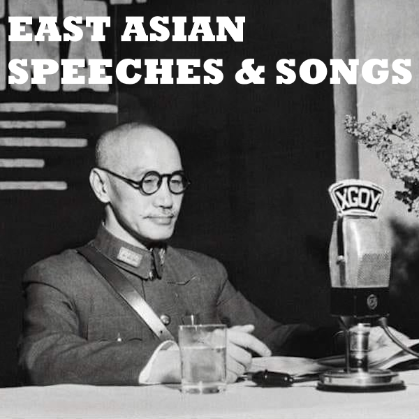

# 東亞演講和音乐;East Asian Speeches & Songs

  
  可以在steam创意工坊订阅: <https://steamcommunity.com/sharedfiles/filedetails/?id=3206724013>

## 主要内容

演讲及音乐列表（演讲会在特定事件后播放）：

Chiang Kai-shek's Victory Speech 抗战勝利告全國軍民及全世界人士書
Jewel Voice Broadcast 玉音放送
Two Questions Speech 兩種懷疑心理之解釋
Proclamation of the People's Republic of China 中华人民共和国开国大典
Declaration of War Against America 大詔を拝し奉りて
Address by Madame Chiang to American Congress 蔣夫人在美國國會的講話
Plum Bossom 梅花
National Anthem of the Republic of China 国歌
Flag Anthem 国旗歌
Struggling in the Southeast-Instrumental 东南苦行山演奏曲
Ode to the Republic of China 中華民國頌
March of Plum Blossom 梅花進行曲
Dreaming of Camel Bells 夢駝鈴
Bloodshed Yellow Flower 碧血黄花
Li Ge 驪歌
Crabapple Blood And Tears 海棠血淚
19th Route Army 十九路軍
The Discolored Great Wall 變色的長城
Along the Songhua River 松花江上
Dance of Youth 青春舞曲
Founding Father Memorial Song 国父紀念歌
The Wandering Songstress 天涯歌女
Graduation Song 畢業歌
Huben Hurray! 虎賁萬歲!
March of the Volunteers 義勇軍進行曲
Orphans of Asia 亞細亞的孤兒
Song Bie 送別
Struggling in the Southeast 东南苦行山
Ambitions to the Sky 壯志凌霄
The Evening Primrose 夜來香
The Great Wall Ballad 長城謠
Heart of Steel 鋼鐵的心
The Patriotic Song 대한민국임시정부의 애국가
Night Raid 夜襲
Xizi Girl 西子姑娘
Ye Shanghai 夜上海
Descendants of the Dragon 龍的傳人
I Have a Rifle 我有一支槍
Gongxi Gongxi 恭喜恭喜
The Eternal August 14th 永生的八一四
When Will You Return 何日君再來
Flowers and Boys 花兒與少年
Dadao March 大刀進行曲
Defend the Yellow River 保卫黄河
Red Sun in the Sky 天上太阳红彤彤
Military and Civilian Mass Production 军民大生产
Without the Communist Party, There Would be No New China 没有共产党就没有新中国
Nanniwan 南泥湾
Socialism is Good 社会主义好
Song of the New Fourth Army 新四军军歌
Tunnel Warfare 地道战
Hotaru no Hikari 蛍の光
Dōki no Sakura 同期の桜
Genkō 元寇
Gunkan Kōshinkyoku 軍艦行進曲
Battōtai 抜刀隊
Hokushi Hakengun no Uta 北支派遣軍の歌
Anthem of the Kwantung Army 関東軍軍歌
Manchu Musume 満州娘
Nanshi Hakengun no Uta 南支派遣軍の歌
Ode of Showa Restoration 昭和維新の歌
Specialty of Infantry 歩兵の本領
I Hate These Classes 学科嫌い
Manchu Musume 滿洲姑娘
Cup of Solid Gold 鞏金甌
National Anthem of Manchukuo(1942-1945) 滿洲國國歌(1942-1945)
The Last Emperor Main Title Theme 末代皇帝主題曲
Anthem of the South Manchuria Railway Company 滿鐵社歌
National Anthem of Manchukuo(1933-1942) 滿洲國國歌(1933-1942)
Where Is Armo 阿嬷在哪里

